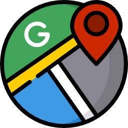
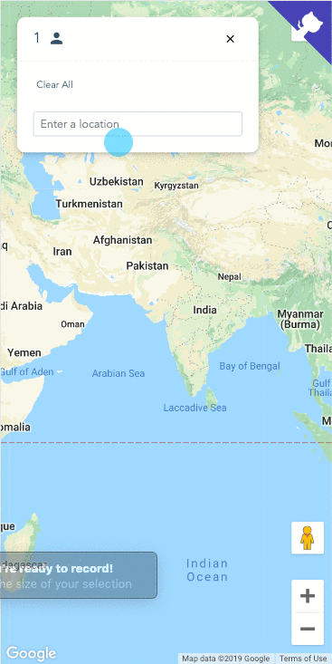

  

<h3 align="center">👬 Meet In The Middle</h3>

 • Generate GroupID &nbsp; 🔖 &nbsp; &nbsp; • Share link with friends &nbsp; 📢 &nbsp; &nbsp;• Find places to meet &nbsp;🍴🥓
      

    <b>
        <a href="https://inishchith.github.io/MeetInTheMiddle/">
            live demo
        </a> 
    </b>
      
    
    
 <b> MoboView </b>

     
    
    
 <b> WebView </b> 

### Usage

- Generate Group Id
- Share link with friends
- Now all your friends share same view via [interweb](https://www.pubnub.com/) 🎉
- Find places to meet 😛

> Exhaustive List of TODO [here](./TODO.md)

#### Buy a coffee 😉

> If you like what you see and would like to support the project, consider buying me a coffee ☕️

#### Recognition

- Featured on **Product Hunt** and [#4 Product](https://www.producthunt.com/posts/meet-in-the-middle) on `13th December 2018` with **500+ Upvotes**
